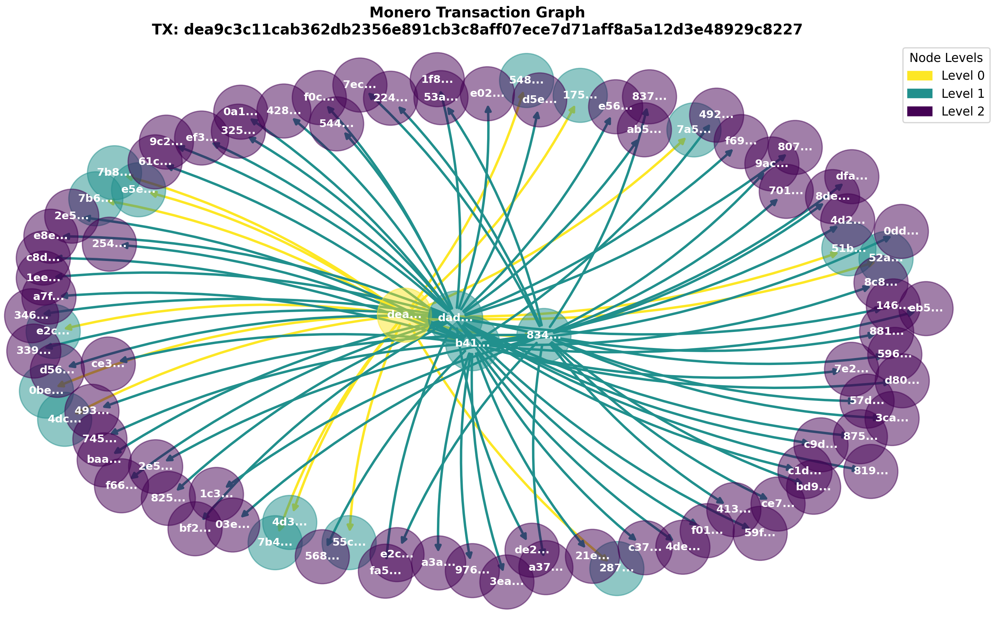

# Monero Transaction Graph Generator

This tool is designed for Monero (XMR) enthusiasts, researchers, and developers who require visualisation of Monero transactions. It enables users to  create visual graphs for transaction flows from a root transaction hash. It requires the Monero daemon (`monerod`). It also requires database mapping ring members to their transaction hashes. As this database is too big to upload to GitHub (>50 GB), users are required to create it, which can be done easily by choosing option 1 from the main menu of main.py. However, this may take more than three days to complete.

## Example Transaction Graph

Below is an example of a transaction graph generated by this tool, illustrating the flow of transactions from a specific transaction hash (dea9c3c11cab362db2356e891cb3c8aff07ece7d71aff8a5a12d3e48929c8227):




## Features

- **Database Updates:** Automatically updates a local database with the latest transactions from the Monero blockchain.
- **Transaction Graph Creation:** Generates visual graphs for transaction flows given a specific transaction hash.
- **Monerod Health Check:** Verifies if the Monero daemon (`monerod`) is running and prompts the user if it is not detected.
- **User Interaction:** Offers a simple command-line interface for users to select options and input data.

## Prerequisites

Before you begin, ensure you have met the following requirements:

- **Python 3.6+** installed on your machine.
- **Monero daemon (`monerod`)** running locally. This tool communicates with `monerod` via its JSON-RPC interface.
- Access to a terminal or command-line interface.

## Installation

1. Clone the repository to your local machine:
    ```bash
    git clone https://github.com/<your-username>/<repository-name>.git
    ```

2. Navigate into the cloned repository directory:
    ```bash
    cd <repository-name>
    ```

3. Install the required Python dependencies:
    ```bash
    pip install -r requirements.txt
    ```

## Usage

To start the tool, run the `main.py` script from your terminal:

```bash
python main.py
```

Upon launch, the tool will perform a check to ensure that `monerod` is running. If `monerod` is not detected, it will prompt you to start it before proceeding.

### Options

The tool provides the following options:

- **Update Transactions Database:** Fetches the latest transactions from the Monero blockchain and updates the local database.
- **Create Transaction Graph from Transaction Hash:** Generates a visual graph representing the transaction flow from a specified transaction hash.
- **Exit Program:** Closes the application.

Follow the on-screen instructions to navigate through these options.

### Configuration

- The database file path and other configurations can be modified directly in the `main.py` file.
- The maximum number of nodes for the transaction graph can be set via the `graph_limit_user_logic` function, with a default limit of 200 nodes.

### Contributing

Contributions to the project are welcome! Please refer to the `CONTRIBUTING.md` file for guidelines on how to contribute to this project.

### License

This project is licensed under the MIT License - see the LICENSE file for details.
